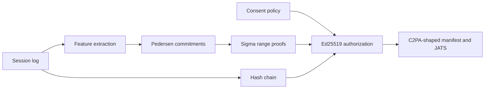

# Architecture

ZK-Scribe sits on the author's machine. The publisher sees an attestation file. The witness file, the session log, and the agent seed stay local.



## Session log

A session is JSON. Each event is a timestamp in milliseconds from the start, an operation (`insert`, `delete`, `navigate`, `paste`), a length, and an optional boundary flag. The boundary flag marks a clause or sentence edge. The event does not store the character.

Four captures write that log. `record` reads the terminal. The VS Code extension reads each document change. The Overleaf extension sends each source-editor change to a bridge on `127.0.0.1`, which stores the length and stamps the time. The background watcher reads a file save as one edit. None of them split a change into keystrokes the editor did not report. The watcher keeps a private copy of the file text so it can see the next save. A session captured by the terminal, VS Code, or Overleaf is left as it is when the file later changes on disk. The watcher updates its snapshot and does not append that save.

Planning pauses are gaps from 1,000 to 5,000 milliseconds. A boundary pause is one of those gaps next to a boundary event. Peak rate is the densest two-second window of inserted characters. Revision is delete characters over insert plus delete characters, in parts per thousand.

`src/pop/regions.ts` is the acceptance region for three labels: `composition`, `transcription`, and `automated`. The boxes are disjoint. Anything outside them is `indeterminate`. A bulk insert of 15 or more characters cannot be labeled composition.

## Commitments and range proofs

A feature `m` is committed as `m·G + r·H` on secp256k1. `G` is the standard generator. `H` is an independent generator from RFC 9380 hash-to-curve, with a fixed domain separator, so the agent does not know a discrete log between `G` and `H`.

The range proof shows `low ≤ m ≤ high` without opening `m`. It decomposes `m - low` and `high - m` into bits, proves each bit is 0 or 1 with a Fiat-Shamir OR proof, and proves the bits sum to the committed integer with a Schnorr proof on `H`. Verifiers recompute the challenges from the statement hash, so a proof cannot be moved onto a different manuscript or role.

The composition box is the statement the publisher checks. The numeric feature values stay inside the commitments.

## Sequential work

`sequentialWorkHead` is a hash chain:

```text
state_0 = SHA-256("ZK-Scribe/swf/v1" || sessionId || contentHash)
state_i = SHA-256(state_{i-1} || digest(event_i))
```

The head is public. The events are not. `audit` recomputes the head from the local session and checks that the witness openings match both the extracted features and the published commitments.

A hash chain can be rebuilt as fast as it can be hashed. It stops a third party from reordering a published proof. When a session carries a drand quicknet anchor, the chain label also includes those two round signatures, and `verify` checks that the public duration fits between the rounds. The holder of the agent key can still invent the events inside that window and hash them in one pass. A delay function would be what forces the hashing to take the time the timestamps claim.

## Agent authorization

Every attestation carries a CVA payload: the agent public key, the action (`attest.process` or `attest.assert`), the policy hash, the statement hash, and the commitments. The agent signs that payload with Ed25519.

`verify` accepts the signature only when all of the following hold:

- The public key matches the trusted key.
- The embedded policy matches the expected policy file.
- The policy allows the action and does not deny it.
- The role binding agrees with the CRediT feasibility of that role.
- Process bindings carry valid composition range proofs and meet the public minimums: at least 8 seconds and 20 inserted characters, and no bulk inserts.

The default policy allows timing capture, process attestation, signed assertions, and manifest export. It denies export of raw events, plaintext, and witnesses.

An author key can issue a grant for one agent, one policy hash, one manuscript hash, and a list of actions. `attest` and `export` honor `.zk-scribe/grant.json` when that file is present, and the agent signature covers the grant hash. A publisher checks the grant file with `verify --grant`. `--require-grant` rejects an attestation that carries no grant hash.

Each governed decision is appended to `.zk-scribe/private/journal.jsonl`. The file stays local. Every entry is signed by the agent key and linked to the hash of the previous entry. `journal` checks that chain. The holder of the agent seed can still append a new entry. The chain shows an edit to an earlier entry, and an entry that was not signed by the recorded key.

This is the transparent form of the authorization relation: the publisher sees the action and the policy. A later zero-knowledge authorization proof would hide policy detail the publisher does not need. It would still have to bind the same four elements: agent, request, execution context, and policy.

## Manifests

`export --format c2pa` writes a JSON profile with four assertions:

- `c2pa.actions` for the tool that produced the bundle
- `c2pa.ai-disclosure` for a process-derived disclosure status
- `zk-scribe.process-attestation` for the statement hash and the attestation
- `zk-scribe.credit` for the role binding

The disclosure status describes the timing pattern. A composition proof does not say the prose is true, and a non-human timing pattern does not name a model.

`export --format jats` writes a `custom-meta-group` a Manubot pipeline can place in the JATS header. The header carries hashes and the binding. The full proof stays in the attestation file.

The profile uses C2PA's assertion names so a publisher can find them. It is not a CAWG JUMBF box and it is not a COSE signature. Native C2PA manifests sign tool actions. They do not, by themselves, show that a person composed the text. ZK-Scribe's substantive claim is the process attestation inside the manifest.
